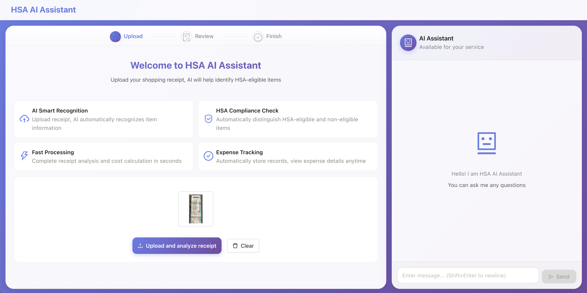
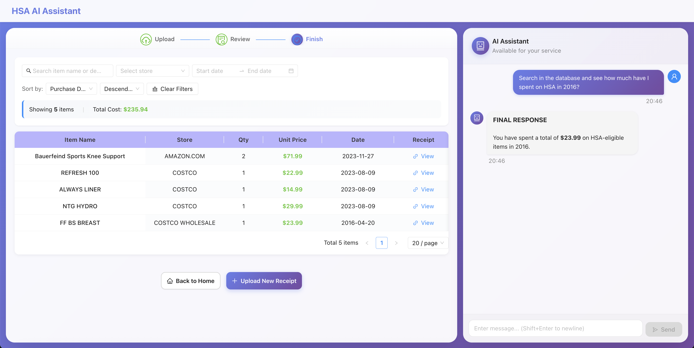
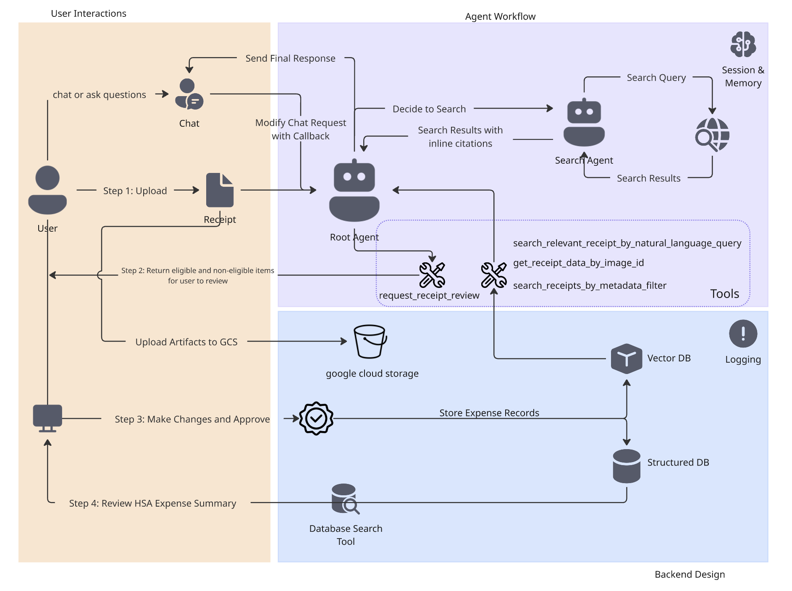

# HSA AI Assistant

The link to our deployed HSA AI Assistant: https://hsa-ai-assistant-frontend-111362542486.us-central1.run.app/

# Problem

Health Savings Account (HSA) holders face the challenge of managing receipts and eligibility for medical expenses. Unlike Flexible Spending Accounts (FSAs), where non-qualified purchases are automatically blocked, HSA users can spend on anything – risking taxes and penalties if those expenses aren’t eligible [[1]](https://www.hrmorning.com/articles/hsa-requirements-receipts-recordkeeping/#:~:text=,track%20the%20purchases%20employees%20make). The IRS requires account holders to verify that each expense is HSA-eligible and retain receipts as proof [[2]](https://www.hrmorning.com/articles/hsa-requirements-receipts-recordkeeping/#:~:text=up%20with%20a%20tax%20bill,it%E2%80%99s%20important%20to%20help%20your). Failure to do so can result in a 20% penalty on unqualified purchases (plus income tax on that amount) if audited [[3]](https://www.hrmorning.com/articles/hsa-requirements-receipts-recordkeeping/#:~:text=is%20to%20help%20employees%20avoid,for%20at%20least%20that%20long).

In practice, many people either stash paper receipts in shoeboxes or don’t track them at all [[4]](https://www.health-ecommerce.com/post/simplify-your-tax-free-hsa-funds-with-the-hsa-store-expense-tracker#:~:text=than%20%24137%20billion%20in%20HSAs,that%20are%20paid%20for%20online). This leads to disorganization, potential loss of documentation, and missed opportunities for reimbursement. Users often resort to manual spreadsheets and cloud folders (e.g. Google Drive) to log expenses [[5]](https://www.hrmorning.com/articles/hsa-requirements-receipts-recordkeeping/#:~:text=don%E2%80%99t%20get%20into%20hot%20water,tracking%20expenses%20a%20healthy%20habit). Clearly, there is a need for a smarter system that automates receipt capture, validates HSA eligibility, and organizes expenses for easy reimbursement and tax reporting.

HSAs are growing rapidly in popularity as a healthcare and retirement savings tool. As of mid-2024, Americans held $137+ billion across nearly 38 million HSA accounts [[6]](https://www.health-ecommerce.com/post/simplify-your-tax-free-hsa-funds-with-the-hsa-store-expense-tracker#:~:text=An%20HSA%20is%20a%20tax,at%20all%E2%80%93which%20can%20cause%20them) – a number that has been climbing yearly. This growth means more individuals and families need to track their healthcare purchases and maximize the “triple tax advantage” of HSAs (pre-tax contributions, tax-free growth, tax-free withdrawals for medical expenses). However, surveys and expert insights indicate that **many HSA account holders are unaware of or overlook the need to document eligible purchases** [[7]](https://www.health-ecommerce.com/post/simplify-your-tax-free-hsa-funds-with-the-hsa-store-expense-tracker#:~:text=than%20%24137%20billion%20in%20HSAs,that%20are%20paid%20for%20online). They may keep paper receipts (which can fade or get lost) or inconsistently record expenses, risking lost reimbursements and non-compliance.

There is clear user demand for convenient HSA tracking solutions. Online forums show users discussing ad-hoc methods (from saving PDFs in Google Drive to maintaining Excel logs) and seeking dedicated tools. In fact, the pain point of organizing HSA receipts has given rise to several specialized apps and services in recent years, confirming a market need.

# Solution

## Competitor Analysis

We started with investigating several existing solutions that aim to simplify HSA/FSA expense tracking including HSA Store ExpenseTracker, Silver, TrackHSA.com etc. Though none perfectly address all needs yet, they have overall validated the market need and highlighted trends we can leverage: OCR and AI for receipt scanning, database of eligible expenses for verification, cloud synchronization, and user-friendly interfaces for tracking and reporting. 

Many current offerings are siloed (one might scan receipts but not handle web search for obscure items, another might auto-connect purchases but lacks conversational queries, etc.). This project aims to combine and improve these capabilities into a single intelligent agent.

## Agent Workflow

The AI agent will operate through a straightforward, user-centric workflow. Below is an outline of how a typical interaction would work:

1. **Capture or Upload Receipt:** The user inputs a receipt – this could be a photo taken via smartphone, a scanned image, or a PDF from an online provider. For example, a user might upload a pharmacy receipt or an Explanation of Benefits (EOB) document.



2. **OCR and Data Extraction**: The agent uses a multimodal LLM such as Gemini 2.5 as its core to extract text from the receipt image. Key fields like date, provider/merchant name, line-item descriptions, and discounts, and final amounts are identified. 

3. **HSA Eligibility Check**: For each expense item, the agent evaluates its HSA eligibility using its internal knowledge and web search tool when uncertain. This step may involve calling an external API or searching the web (as the agent is allowed internet access) to confirm edge cases. 

4. **AI Assistance and Confirmation**: The agent can annotate the receipt data with preliminary decisions (e.g., marking each line or the whole receipt as “HSA-eligible”, “not eligible”, "unsure"). It might also estimate the product name (e.g., “RX” inferred as "Prescription") based on the product abbreviation on a receipt. This information is then presented to the user through the frontend UI for review. The user can then correct any mistakes (e.g., if the AI misread something or if a borderline item needs user judgment). User review and the ability to modify entries are crucial to maintain accuracy and trust.


5. **Record Storage and Organization**: Once confirmed, the expense record is saved to our structured DB and the embedded receipt file is also saved to our NoSQL Document DB, both hosted on Google cloud Services. The agent will organize HSA-eligible expenses and their proofs for future access. Each record includes details like date, merchant, amount, category, eligibility status, and the associated receipt image or file.

6. **Expense Tracking and Management**: The user can view a summary log of all HSA eligible expenses recorded with filtering or sorting (e.g., by year, by category, by provider) buttons to help users review their spending. 


7. **Natural Language Query Interface**: A standout feature of our agent will be the ability to query your healthcare spending using natural language. Users can ask questions in plain English via a chat interface and the agent will interpret and answer based on the stored data and web search. For example: “How much have I spent on vision care this year?”, “List all eligible expenses over $100”, or “Show my receipts from 2024.” The agent’s NLP component will parse the query, retrieve relevant data (summing amounts, filtering by category/date, etc.), and respond conversationally. This turns static record-keeping into an interactive experience, allowing users to gain insights easily without manually combing through records. 



Future Capabilities (Not There Yet):

8. **Reporting and Export** (planned future capability): The agent will allow users to generate reports or export data for various purposes. For instance, at tax time or when preparing to file a reimbursement claim, the user could export all unreimbursed expenses for the year into a CSV or PDF report. The report might include totals by category (e.g., total dental expenses in 2025) and a list of individual expenses with dates and providers. This makes it easy to submit to an HSA administrator if needed or simply to archive for personal records. Reports also assist in case of an IRS audit by providing a neatly organized summary with links to each receipt image.

Throughout this workflow, the emphasis is on minimizing user effort: automating data entry, leveraging AI for decisions, but keeping the user in control for verification. The agent should feel like a helpful personal accountant for healthcare spending – always available to log a purchase or answer a question about your HSA.


# Architecture



## Frontend: User Interactions

The frontend facilitates four key user interactions. Below is the flow of data between the user and the API.

### 1. Chat & Query
*   **User Action**: User types a message (e.g., "Analyze this receipt") or uploads a file in the chat interface.
*   **API Request (`POST /chat`)**:
    *   **Input**: `{ text: string, files: Base64[], session_id: string, user_id: string }`
*   **API Response**:
    *   **Output**: `{ response: string, review_request?: ReceiptData, attachments: string[] }`
*   **Frontend Action**: Displays the natural language response. If a `review_request` is present, automatically navigates the user to the **Review Interface**.

### 2. Receipt Upload (Step 1)
*   **User Action**: User uploads a receipt image via the dedicated upload area or chat.
*   **API Request (`POST /chat`)**:
    *   **Input**: `{ text: "Please analyze this receipt", files: [Base64Image], ... }`

### 3. AI Analysis & Review Request (Step 2)
*   **System Action**: The AI Agent analyzes the receipt, identifying items and categorizing them as HSA-eligible or non-eligible.
*   **API Response**:
    *   **Output**: Returns a structured `review_request` object containing extracted data (store, date, items) and their eligibility status.
*   **Frontend Action**: Automatically navigates the user to the **Review & Approve** page to verify the AI's classification.

### 4. Review & Approve (Step 3)
*   **User Action**: User verifies and edits the extracted receipt data (e.g., correcting prices, moving items between "HSA Eligible" and "Non-Eligible" categories) and clicks "Approve".
*   **API Request (`POST /review`)**:
    *   **Input**: `{ receipt_id: string, approved_hsa_eligible_items: Item[], approved_non_hsa_eligible_items: Item[], ... }`
*   **API Response**:
    *   **Output**: `{ items: ItemFull[] }` (Returns the fully processed and stored item records).
*   **Frontend Action**: Displays a success message and automatically navigates the user to the **Expense Summary** page (Step 4).

### 5. Expense Summary (Step 4)
*   **User Action**: User navigates to the Summary page to view their HSA spending report.
*   **API Request**:
    *   *Note: Currently integrated within the chat flow or local state management.*
*   **Frontend Action**: Visualizes the user's total HSA-eligible expenses vs. non-eligible expenses using the data confirmed in Step 3.

## Agent Workflow: Task Delegation with Tools

Core to our hsa expense assistant is the expense manager agent which handles both text and image user requests with dedicated prompt instructions and default diverse thinking mode.

**Multi-agent system**: The system is built on a multi-agent architecture where agents are powered by Large Language Models (LLMs). The primary agent delegates specific sub-tasks to specialized agents or tools, ensuring efficient and accurate processing of complex user requests. 


### 1. Agent Custom Tools

The expense manager agent uses four custom tools to handle receipt data and queries:

**Request Receipt Review (request_receipt_review)**

When the agent processes a receipt image, it extracts store name, date, total cost, payment card details, and itemized line items. It categorizes items into three groups: HSA-eligible, non-HSA-eligible, and unsure-HSA. This tool initiates the human review workflow required before storage. It validates input data (date formats, item structure, payment details) and returns a JSON payload for the backend to present to users in the review interface. This ensures accuracy and compliance before committing to persistent storage.

**Get Receipt Data by Image ID (get_receipt_data_by_image_id)**

This tool retrieves previously stored receipt data using the unique image identifier extracted from uploaded receipt images. When users reference a specific receipt (e.g., "show me the receipt with image ID 12345"), the agent uses this tool to fetch the document from Firestore. It returns receipt metadata, including store name, transaction time, total amount, currency, and all three item categories. If the receipt does not exist, it returns an empty dictionary, allowing the agent to handle missing receipts.

**Search Receipts by Metadata Filter (search_receipts_by_metadata_filter)**

This tool performs structured queries using temporal and monetary filters. It accepts ISO-format start and end times, along with optional minimum and maximum total amount constraints. The tool builds composite Firestore queries using field filters on transaction_time and total_amount, enabling date-range and amount-range searches. Results include all matching receipts with metadata and items. This tool supports queries like "show me all receipts between January and March" or "find receipts over $100."

**Search Relevant Receipts by Natural Language Query (search_relevant_receipts_by_natural_language_query)**

This tool uses semantic search via vector embeddings to find receipts by meaning rather than exact matches. It generates an embedding for the query text using Google's text-embedding-004 model, then performs a vector similarity search in Firestore against pre-computed receipt embeddings. The embeddings capture store names, item names, and other receipt details, enabling natural queries like "coffee purchases" or "groceries at Whole Foods" without requiring exact string matching. The tool returns the top-k most semantically similar receipts (default limit of 5), supporting flexible, contextual search.


### 2. Sub Agent as Tool

We utilize a multi-agent architecture where specialized agents function as tools for the root agent. The `web_search_agent` is a prime example, powered by `gemini-2.5-flash` and equipped with the built-in `google_search` tool. When the root `expense_manager_agent` encounters a query requiring external knowledge (e.g., verifying if a specific item is HSA-eligible), it delegates the task to the `web_search_agent`, which performs the search and returns cited findings.

### 3. Session & Memory Management

**Sessions & State Management**: We use `InMemorySessionService` to manage active chat sessions, maintaining the immediate conversation state in memory for fast access. `GcsArtifactService` handles the storage of large artifacts like receipt images, keeping the context window lightweight.

**Long-term Memory**:
*   **Firestore (Vector DB)**: Stores receipt embeddings and metadata, enabling semantic search and retrieval of past expenses.
*   **SQLite (Structured DB)**: Acts as the definitive record for approved, structured expense data, ensuring data integrity for reporting.

### 4. Context Engineering

To optimize the context window and improve agent performance, we employ context engineering techniques via callbacks:
*   **Context Compaction**: `modify_image_data_in_history` processes chat history before it reaches the model, managing how image data is represented to prevent context overflow.
*   **Response Enhancement**: `add_inline_citations_callback` post-processes the agent's output to ensure citations from the web search agent are correctly formatted and integrated.

## Backend: Database and Logging

**Observability**: The backend implements comprehensive structured logging using a custom `logger` module. Every request is tracked via `RequestLoggingMiddleware`, capturing inputs, processing times, and errors. The agent's thought process (thinking mode) and final responses are also logged, providing full visibility into the AI's decision-making.

**Deployment**: The system is deployed as decoupled microservices on Google Cloud Run. The frontend and backend are containerized separately, allowing for independent scaling and maintenance. The backend connects to Google Cloud services (Firestore, Vertex AI, Cloud Storage) using application-default credentials.


# Agent Deployment Instructions

## Frontend Setup

### 1. Local Development

To run the frontend application locally on your machine:

**Prerequisites**:
*   Ensure **Node.js** (v18 or higher recommended) is installed on your machine.

1.  **Navigate to the frontend directory**:
    ```bash
    cd frontend
    ```

2.  **Install dependencies**:
    ```bash
    npm install
    ```

3.  **Start the development server**:
    ```bash
    npm run dev
    ```

4.  **Access the application**:
    Open your browser and visit `http://localhost:3000`.

    > **Note**: Ensure your backend service is running locally. The frontend is configured (via `vite.config.ts`) to proxy `/api` requests to the backend server (default: `http://localhost:8080`).

### 2. Deployment to Google Cloud

We provide an automated shell script to streamline the deployment process to Google Cloud Run.

1.  **Prerequisites**:
    Ensure you have the Google Cloud SDK installed and are authenticated:
    ```bash
    gcloud auth login
    gcloud config set project YOUR_PROJECT_ID
    ```

2.  **Run the deployment script**:
    Execute the following command from the `frontend` directory:
    ```bash
    ./deploy-frontend.sh
    ```
    *This script performs the following actions:*
    *   *Builds a production-ready Docker image for the frontend.*
    *   *Pushes the image to the Google Container Registry (GCR).*
    *   *Deploys the image as a stateless container to Cloud Run.*

3.  **Access the deployed app**:
    Once the script completes successfully, it will output the **Frontend Address** (e.g., `https://hsa-ai-assistant-frontend-xyz.a.run.app`). You can access your live application via this URL.


## Backend

### Local Development

1. **Create a Google Cloud Project**
   - In Google Cloud Console, create a new project

2. **Create a Firestore Database**
   - Set up a Firestore database in your project

3. **Enable Required Services in Cloud Shell Terminal**
   
   ```bash
   gcloud services enable aiplatform.googleapis.com \
                       firestore.googleapis.com \
                       run.googleapis.com \
                       cloudbuild.googleapis.com \
                       cloudresourcemanager.googleapis.com
   ```

4. **Prepare Google Cloud Storage Bucket**
   
   ```bash
   gsutil mb -l us-central1 gs://personal-expense-{your-project-id}
   ```
   
   > **Note:** Replace `{your-project-id}` with your actual project ID

5. **Create Firestore Indexes**
   
   a. **Composite index for compound queries:**
   
   ```bash
   gcloud firestore indexes composite create \
     --collection-group=personal-expense-assistant-receipts \
     --field-config field-path=total_amount,order=ASCENDING \
     --field-config field-path=transaction_time,order=ASCENDING \
     --field-config field-path=__name__,order=ASCENDING \
     --database="(default)"
   ```
   
   b. **Vector search index:**
   
   ```bash
   gcloud firestore indexes composite create \
     --collection-group="personal-expense-assistant-receipts" \
     --query-scope=COLLECTION \
     --field-config field-path="embedding",vector-config='{"dimension":"768", "flat": "{}"}' \
     --database="(default)"
   ```

6. **Install Google Cloud CLI and Authenticate**
   
   ```bash
   gcloud auth application-default login
   ```

7. **Set Up Python Environment and Dependencies**
   
   ```bash
   uv sync --frozen
   ```

8. **Run Backend Locally**
   
   ```bash
   uv run backend.py
   ```

9. **Access Backend Swagger API**
   - Open your browser and navigate to: `http://localhost:8080/docs`

### Deploy to Cloud

To deploy the backend to Cloud Run, use the following command:

```bash
gcloud run deploy personal-expense-assistant \
  --source . \
  --port=8080 \
  --allow-unauthenticated \
  --env-vars-file=settings.yaml \
  --memory 1024Mi \
  --region us-central1
```

**Notes:**
- Replace `personal-expense-assistant` with your preferred service name
- Ensure `settings.yaml` exists and contains the necessary configuration
- The `--allow-unauthenticated` flag makes the service publicly accessible
- Adjust `--memory` if needed based on your requirements
